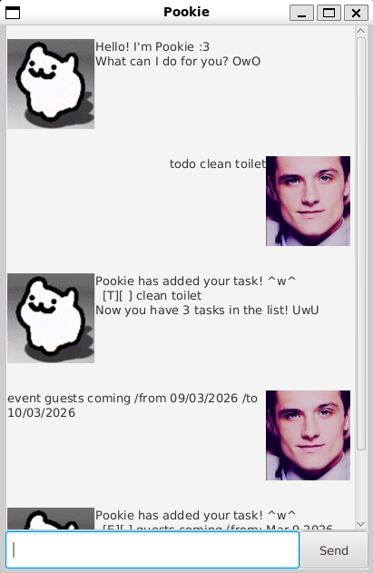

# Pookie Task Manager

> Your adorable task management companion! :3

Pookie helps you keep track of your todos, deadlines, and events. Never forget what you need to do again! ^w^



## Quick Start

1. Download the latest `pookie.jar` from the [releases page](../../releases)
2. Double-click the file to start, or run: `java -jar pookie.jar`
3. Type commands in the text field and press Enter
4. Type `help` to see all available commands

## Command Summary

| Action | Command | Example |
|--------|---------|---------|
| Add a todo | `todo <description>` | `todo read book` |
| Add a deadline | `deadline <description> /by <date>` | `deadline report /by 2026-02-20` |
| Add an event | `event <description> /from <date> /to <date>` | `event meeting /from 2026-02-18 /to 2026-02-18` |
| List all tasks | `list` | `list` |
| Mark as done | `mark <index>` | `mark 1` or `mark 1 3-5` |
| Mark as not done | `unmark <index>` | `unmark 2` |
| Delete tasks | `delete <index>` | `delete 2` or `delete 1-3` |
| Find tasks | `find <keyword>` | `find book` |
| Get help | `help` | `help` |
| Exit | `bye` | `bye` |

> **Note:** Dates must be in `yyyy-MM-dd` format (e.g., `2026-02-15`)

---

## Features

### Adding tasks

**Todo** - Simple tasks without dates
```
todo buy groceries
```

**Deadline** - Tasks with a due date
```
deadline submit report /by 2026-02-20
```

**Event** - Tasks with a time period
```
event conference /from 2026-03-01 /to 2026-03-03
```


### Managing tasks

**List all tasks**
```
list
```
Shows all your tasks with their status.

**Mark tasks as done**
```
mark 1
mark 1 3 5
mark 2-4
```
You can mark single tasks, multiple tasks, or ranges.

**Unmark tasks**
```
unmark 1
```
Same syntax as `mark`.

**Delete tasks**
```
delete 2
delete 1-3
```
Permanently removes tasks. Same syntax as `mark`.

**Find tasks**
```
find meeting
```
Search for tasks containing a keyword.


### Getting help

Type `help` anytime to see the full list of commands with examples.


### Exiting

Type `bye` to exit. The app will close after 5 seconds.

---

## FAQ

**Q: Where is my data saved?**  
A: Your tasks are automatically saved to `pookie_data.txt` in the same folder as the app. Everything saves automatically!

**Q: Do I need to install anything?**  
A: Just Java 17 or above. Your system might already have it!

---

Made with ♥ and lots of uwu
